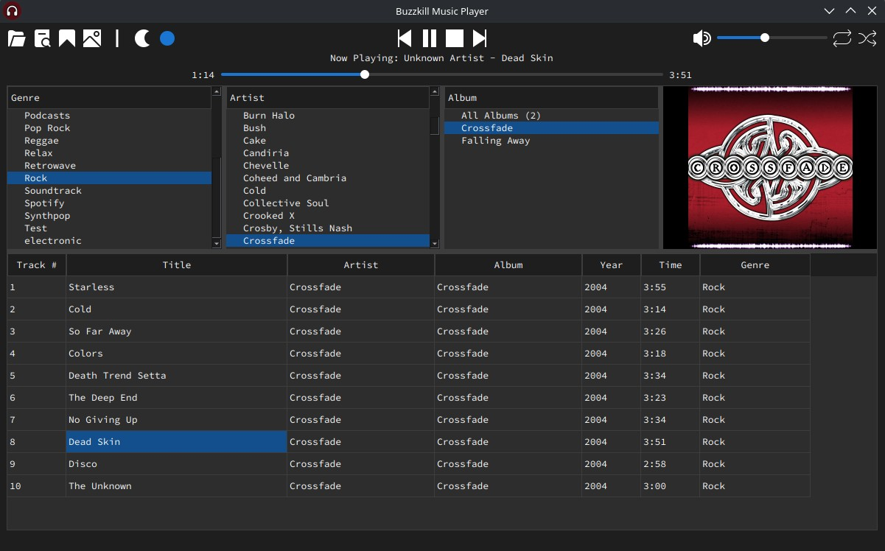

# BUZZKILL Music Player

Buzzkill is a poor MusicBee alternative for ***Linux*** (and ***Windows*** if, for some reason, you don't want to use MusicBee -- but why?). A lightweight desktop music player built with Python + PyQt6. Browse your library and play audio with a simple interface.




## Requirements
- Python 3.10+
- pip
- Git (optional, for cloning)


## Setup
Clone or download the project, then open terminal in the project folder (the folder containing buzzkill-music-player.py).

You should see:
```
buzzkill-music-player.py
icons/
requirements.txt
launch-linux.sh
launch-windows.bat
```


### Linux (Ubuntu / Debian)
```
python3 -m venv venv
source venv/bin/activate
pip install -r requirements.txt
```
Close the terminal and run **launch-linux.sh**


### Windows
```
python -m venv venv
call venv\Scripts\activate
pip install -r requirements.txt
```
Close the terminal and run **launch-windows.bat**


## Instructions
- On first launch, click the folder icon in the top-left to choose your music library folder (example: C:\Users\CoolGuy\Music). *Note: The app only supports one folder at this time.*

- The Bookmark button tells the app to remember the playback position of your music. When enabled, you can close the app and maintain playback position the next time you launch the app.


## Troubleshooting
If Linux users get an error when running the venv command, you *may* need to install python3-venv:
```
sudo apt install python3-venv
```


## Special Thanks
Unicons by [Flaticon](https://www.flaticon.com/uicons).

<br/><br/>
## AI Disclaimer
100% of this application was vibe coded. I am not a programmer. The only reason I started this project is because I couldn't find a suitable alternative for MusicBee on Linux.