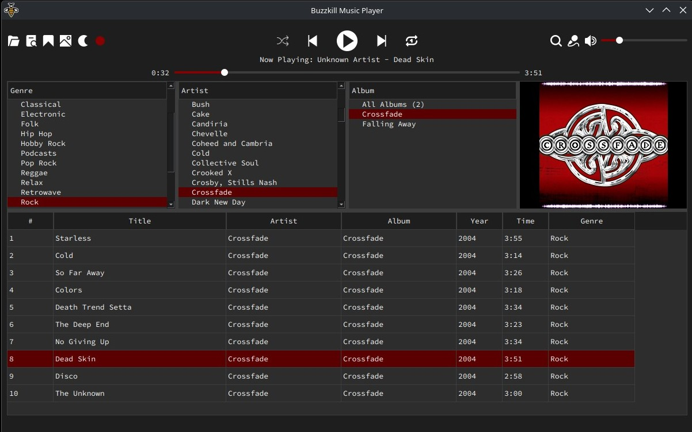

# Buzzkill Music Player

Buzzkill, a desktop music player built with **Python** and **PyQt6**, is a poor MusicBee alternative for ***Linux*** (and ***Windows*** if, for some reason, you don't want to use MusicBee... but why?). Browse your music library and play audio with a simple interface.




## Requirements
- Python 3.10+
- pip
- Git (optional, for cloning)


## Setup
Clone/Download this repo. Open terminal in the project folder (the folder containing buzzkill-music-player.py).

You should see (but not limited to):
```
buzzkill-music-player.py
fonts/
icons/
launch-linux.sh
launch-windows.bat
requirements.txt
```


### Linux (Ubuntu / Debian)
```
python3 -m venv venv
source venv/bin/activate
pip install -r requirements.txt
```
Close the terminal and run <ins>**launch-linux.sh**</ins>


### Windows
```
python -m venv venv
call venv\Scripts\activate
pip install -r requirements.txt
```
Close the terminal and run <ins>**launch-windows.bat**</ins>


## Special Thanks
Unicons by [Flaticon](https://www.flaticon.com/uicons).


## AI Disclaimer
100% of this application was made with assistance from an AI agent. I am not a programmer. The only reason I started this project was because I couldn't find a suitable alternative for MusicBee on Linux. So, if the app gains sentience and takes over the world, I do apologize. Stay safe out there, fellow humans.