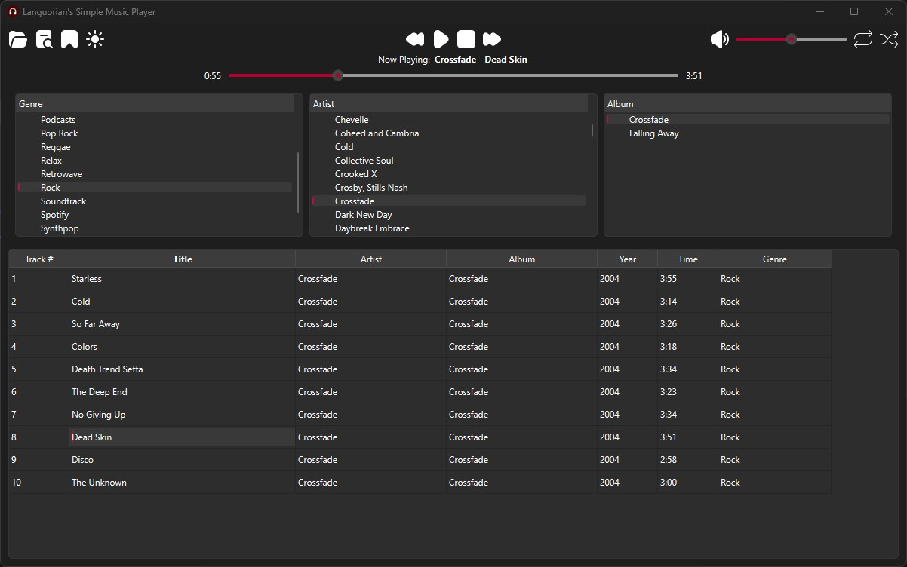

# Simple Music Player

A lightweight desktop music player built with Python + PyQt6.
Browse your library and play audio with a simple interface.



## Requirements
- Python 3.10+
- pip
- Git (optional, for cloning)

## Setup
Clone or download the project, then open terminal/command-prompt in the project folder (the folder containing simple-music-player.py).

You should see:
```
simple-music-player.py
icons/
requirements.txt
launch-linux.sh
launch-windows.bat
```

### Linux (Kubuntu / Ubuntu / Debian)
```
sudo apt install python3-venv
python3 -m venv venv
source venv/bin/activate
cd ../..
pip install -r requirements.txt
```
launch-linux.sh

### Windows
```
python -m venv venv
cd venv\Scripts
activate
cd ../..
pip install -r requirements.txt
```
launch-windows.bat

## Instructions
- On first launch, click the folder icon in the top-left to choose your music library folder (example: C:\Users\CoolGuy\Music). The app may freeze for a few seconds as it scans your files. When finished, the library will populate with your music.
*Note: The app only supports one folder at this time.*

- The app does not actively monitor your library. If you make any changes (add files, delete files, etc.), you will have to manually rescan your library by clicking the Rescan button (top-left).

- The Bookmark button tells the app to remember the playback position of your music. When enabled, you can close the app and maintain playback position the next time you launch the app.

- The Dark/Light theme button is unfinished and can be ignored.

